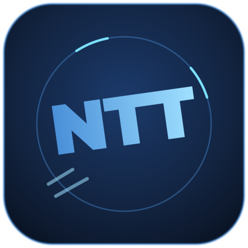

[](https://badges.pufler.dev)

#  EVE Night Trade Tools

A desktop trading toolkit for [EVE Online](https://www.eveonline.com/), built with Kotlin/JVM and Jetpack Compose for Desktop. It talks to CCP's ESI API (OAuth2 SSO) to pull your characters' orders, wallet, assets, and contracts, and layers market analysis, alerts, and a FIFO cost-basis/P&L engine on top.

## Features

- **Dashboard** — at-a-glance summary across your tracked characters
- **Characters** — manage linked EVE characters via SSO
- **Market** — browse regional market orders and price history
- **Analysis** — trade-hub comparison and market analysis tools
- **Assets** — inventory viewer across stations/structures
- **Wallet** — transaction journal and P&L
- **Orders** — active buy/sell orders with margin and market-comparison columns, order history, and a FIFO-costed inventory view
- **Watchlist** — track items with sparklines
- **Alerts** — price alerts with in-app notifications
- **Contracts** — contract tracker
- **Tools** — cargo splitter and a sell-pricing calculator that scopes prices to your character's current docked station
- **P2P Market** — peer-to-peer OTC trading over [Nostr](https://nostr.com/): post buy/sell orders, negotiate reservations over encrypted DMs, and settle in-game outside the ESI market
- **Trade Calc** — a small always-on-top overlay for quick station-trading margin math: reads SELL/BUY prices from a copied order row or an EVE order-book export, and shows broker/tax fees, profit margin, and real buy-out/sell-out totals walked from the actual order book
- **Settings** — tax rates, data source, and app preferences

Two global hotkeys work even when EVE has focus: **Ctrl+Z** cycles through your queued orders, opens the in-game market window, and copies an overbid/undercut price to your clipboard; **Ctrl+M** opens the Trade Calc overlay at your cursor.

## Requirements

- JDK 21
- ~2 GB free disk for the EVE static data import on first run

No API keys or configuration needed — the ESI OAuth client ID is bundled; you just log in with your EVE account on first launch.

### Installing a JDK 21

Only needed for building/running from source or the fat jar (`java -jar`) — the `.dmg`/`.msi`/`.deb` installers bundle their own runtime.

- **macOS**: download the Temurin 21 `.pkg` for your chip (x64 or aarch64) from [adoptium.net](https://adoptium.net/) and run it — no Homebrew needed (if you do have `brew`: `brew install openjdk@21`)
- **Linux**: `sudo apt install openjdk-21-jdk` (Debian/Ubuntu) or `sudo dnf install java-21-openjdk-devel` (Fedora)
- **Windows**: download the Temurin 21 `.msi` from [adoptium.net](https://adoptium.net/) and run it (or `winget install EclipseAdoptium.Temurin.21.JDK` if you use winget)

Verify with `java -version` — it should report `21`.

### Installing on macOS (unsigned build)

The macOS build isn't signed with an Apple Developer ID or notarized (no paid certificate), so Gatekeeper blocks it on first launch with an "app is damaged" or "unidentified developer" warning. After installing the `.dmg`, clear the quarantine flag once:

```bash
xattr -cr /Applications/eventt.app
```

Two separate downloads are published for macOS — `eventt-macos-x64.dmg` for Intel Macs and `eventt-macos-arm64.dmg` for Apple Silicon (M1/M2/M3/M4) — there is no universal binary; grab the one matching your Mac's chip (Apple menu → About This Mac).

## Auth & data storage

Login uses EVE SSO's OAuth2 Authorization Code flow with PKCE — no client secret is embedded in the app. Character access/refresh tokens are encrypted at rest (AES-256-GCM) with a local, per-machine key, both stored in the OS's standard per-user app-data directory (`%APPDATA%\eventt` on Windows, `~/Library/Application Support/eventt` on macOS, `$XDG_DATA_HOME/eventt` or `~/.local/share/eventt` on Linux). Older installs used `~/.eve-trader/` or `~/.eventt/` directly in the home folder — data there is picked up automatically on first launch after upgrading.

## P2P Market

Off-market player-to-player trading, built on [Nostr](https://nostr.com/) instead of a central server: orders are NIP-33 addressable events published to a handful of public relays (configurable in Settings), and buy/sell negotiation happens over NIP-17 encrypted DMs. Each EVE character gets its own signing identity automatically, generated the first time you open the P2P Market tab with that character selected — nothing to configure beyond that.

For testing both sides of a trade locally, `./scripts/run-p2p-test.sh` launches a second, isolated instance of the app (its own database and Nostr identity, seeded with a throwaway test character) so you can post an order in one window and answer it from the other.

## Building & running

```bash
./gradlew build              # Compile and test all modules
./gradlew run                # Run the desktop app locally
./gradlew test               # Run all unit tests
./gradlew :module:test       # Run tests for a specific module (e.g. :core:database:test)
```

Targets JVM 21 / Kotlin 2.4.0, code style `kotlin.code.style=official`. Linting is enforced via ktlint and detekt:

```bash
./gradlew ktlintCheck         # Style check (ktlintFormat to auto-fix)
./gradlew detekt              # Static analysis
```

Both also run as part of `./gradlew check` and gate CI.

## Packaging

```bash
./gradlew createDistributable   # Portable app-image directory (used for the zip release asset)
./gradlew packageDeb            # .deb installer (Linux)
./gradlew packageMsi            # .msi installer (Windows, per-user install)
./gradlew packageDmg            # .dmg installer (macOS)
./gradlew shadowJar             # Runnable fat jar (java -jar app/build/libs/eventt-<version>.jar)
```

The fat jar is **not** cross-platform despite the format — it bundles whichever OS/arch's Skiko/Compose native rendering libs were present at build time (`compose.desktop.currentOs`). CI builds one per OS (and, for macOS, per arch), released as `eventt-linux.jar` / `eventt-windows.jar` / `eventt-macos-x64.jar` / `eventt-macos-arm64.jar`; grab the one matching your OS, same as the zip or installer.

A NixOS package is also available via `flake.nix` (run `./gradlew createDistributable` first).

## Releases & auto-update

Pushing a tag matching `vX.Y.Z` triggers `.github/workflows/release.yml`, which builds a zip, native installer, and fat jar for Linux/Windows/macOS and publishes them as a GitHub Release. The workflow can also be run manually via `workflow_dispatch` (from the Actions tab) to test the build without cutting a real release.

The app checks the repo's latest GitHub Release on startup and offers a one-click update banner if a newer version is available (see `github.repo` in `gradle.properties`). Self-update works for the portable zip, the `.dmg` install, the per-user `.msi` install, and the fat jar; a system-wide package install (e.g. `.deb` installed via `apt`) can't self-update and will point you to the release page instead.

## Architecture

Modules are organized under `core/`, `features/`, and `ui/`:

- **`core/`**: model, database, http, cache, auth, esi, queue, staticdata, image, everef, marketlogs, nostr
- **`features/`**: characters, market, assets, wallet, orders, dashboard, alerts, contracts, watchlist, settings, overlay, tools, p2pmarket
- **`ui/`**: theme (Material 3 + EVE color palette), common (shared Compose components)

```
Main.kt → DatabaseManager.initialize() → EventtApp (Compose)
    ↓
:features:* → :core:{model, database, auth, esi, cache, queue}
:core:esi   → :core:{auth, cache, http, queue, database}
:core:auth  → :core:{database, http, model}
```


## License

[MIT](LICENSE)
